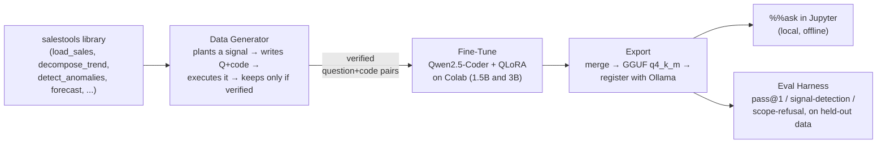
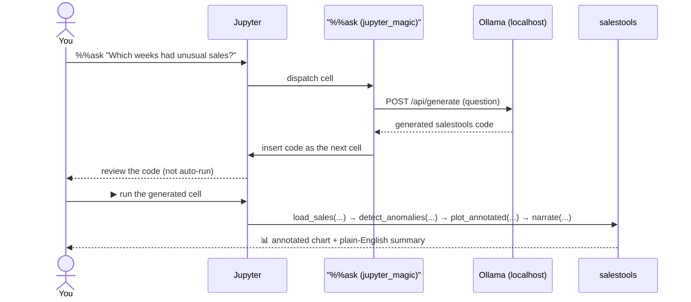

# salestools-analyst

> A locally-run AI assistant that answers questions about your sales data — no cloud, no
> subscription, no data leaving your machine.

Open a Jupyter notebook, load a sales CSV, and ask a question in plain English:

```
%%ask
Which weeks this year had unusual sales, and is my overall trend up or down?
```

A small, fine-tuned language model (running entirely on your own machine via
[Ollama](https://ollama.com)) writes a short analysis script into the next cell. Running it
produces an annotated chart and a plain-English summary — e.g. *"Week 23 was 3.1σ above
expected — likely a promo spike. Underlying trend: +4% monthly growth after removing
seasonality."*

For the full plain-English writeup of the problem and approach, see [`docs/summary.md`](docs/summary.md).

---

## How it works, at a glance

The model is only ever allowed to answer using a small, hand-built library (`salestools`) —
never raw pandas/statsmodels. Training data is synthetic, and every example is verified by
actually *running* it before it's allowed into the dataset — nothing is hand-labeled or trusted
on faith.



Two model sizes (1.5B and 3B parameters) are trained and evaluated side by side, so the
speed-vs-quality tradeoff is measured, not guessed at. See
[`docs/diagrams.md`](docs/diagrams.md) for the full pipeline diagram (including the v1→v2
incremental-retrain lifecycle) and two more detailed sequence diagrams.

### What happens when you type `%%ask`



Nothing leaves your machine — the whole loop is local Ollama inference plus local code
execution.

---

## Project layout

| Path | What's there |
|---|---|
| `salestools/` | The library the model is allowed to write code against (9 public functions) |
| `data/generator/` | Synthetic dataset generator + sandboxed execution verifier |
| `data/v1/`, `data/v2/` | Generated training/held-out/delta JSONL (gitignored — regenerate with `data/generator/generate.py`) |
| `training/` | Fine-tune notebooks (`finetune_1.5b.ipynb`, `finetune_3b.ipynb`, `finetune_1.5b_v2.ipynb`), LoRA configs, `export.sh` |
| `jupyter_magic/` | The `%%ask` IPython cell magic |
| `eval/` | Evaluation harness (`run_eval.py`) and A/B comparison tool (`compare.py`) |
| `models/` | Trained adapters / merged models / GGUF exports (gitignored — large binaries) |
| `tests/` | Unit + integration tests |
| `docs/` | Plain-English project summary, architecture diagrams, spec, constitution |
| `specs/001-sales-analyst-model/` | Full Spec-Kit planning artifacts (spec, plan, data model, contracts, tasks) |

---

## Quickstart

Full setup + phase-by-phase validation lives in
[`specs/001-sales-analyst-model/quickstart.md`](specs/001-sales-analyst-model/quickstart.md).
Short version:

```bash
# Python deps (uses uv, not bare pip)
uv venv
uv pip install -e ".[dev]"
uv run pytest   # 53 unit + integration tests

# Local inference (once a model has been trained + exported — see training/ below)
brew install ollama && ollama serve &
ollama list      # sales-analyst-1.5b / sales-analyst-3b

# In a Jupyter notebook:
#   %load_ext jupyter_magic
#   %%ask
#   Is my overall sales trend going up or down?
```

Training itself runs in Google Colab (`training/finetune_1.5b.ipynb` etc.) — see that
notebook's own intro cell for hardware requirements and step-by-step instructions.

---

## Status

Both the 1.5B and 3B models have been fine-tuned, exported, and evaluated against a 100-example
held-out set — currently scoring 100% pass@1, 100% signal-detection accuracy, and 100%
scope-refusal accuracy for both sizes. The v2 incremental fine-tune (teaching the model new
`forecast`/`cohort_analysis` capabilities without retraining from scratch) is built and ready to
run. See [`specs/001-sales-analyst-model/tasks.md`](specs/001-sales-analyst-model/tasks.md) for
the full, up-to-date task checklist.

## License

MIT — see [`LICENSE`](LICENSE).
