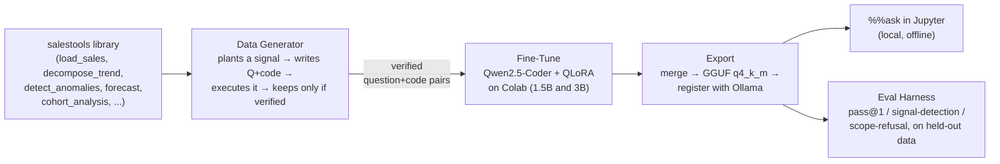
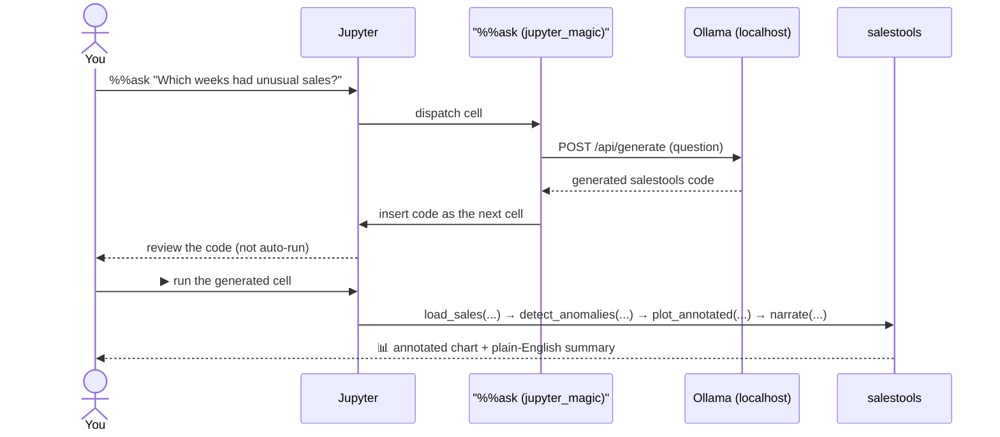

# salestools-analyst

> A locally-run AI assistant that answers questions about your sales data — no cloud, no
> subscription, no data leaving your machine.

---

## Summary

If you have a spreadsheet of sales numbers, you've probably had questions like *"is business
trending up or down?"*, *"were there any unusual weeks?"*, or *"which product is dragging
performance down?"* Answering them today usually means hiring an analyst, learning statistics
software, or pasting your (possibly sensitive) numbers into a cloud AI service.

This project takes a different approach: a small AI assistant that runs entirely on your own
laptop. You load your sales file into a Jupyter notebook (a standard, free data-science tool),
type your question in plain English, and get back a chart and a plain-English answer — no
internet connection required, no data ever leaves your machine, and no subscription.

What makes this more than "a chatbot that writes code" is how it's built: the AI is never
allowed to write arbitrary code, only to call a small, fixed set of pre-built analysis
functions. Every one of its ~1,000 training examples was actually *run* and checked for
correctness before being used to teach the model — nothing was hand-labeled or taken on faith.
That discipline is also why the system can grow: when new capabilities were added later
(forecasting, customer-retention analysis), the model was taught the new material without
forgetting what it already knew — a full before-and-after test suite proves it, rather than
just claiming it.

See [`docs/summary.md`](docs/summary.md) for the longer plain-English walkthrough of the
problem, the approach, and how each piece fits together.

---

## How it works, at a glance

Open a Jupyter notebook, load a sales CSV, and ask a question in plain English:

```
%%ask
Which weeks this year had unusual sales, and is my overall trend up or down?
```

A small, fine-tuned language model (running entirely on your own machine via
[Ollama](https://ollama.com)) writes a short analysis script into the next cell. Running it
produces an annotated chart and a plain-English summary — e.g. *"Week 23 was 3.1σ above
expected — likely a promo spike. Underlying trend: +4% monthly growth after removing
seasonality."*

The model is only ever allowed to answer using a small, hand-built library (`salestools`) —
never raw pandas/statsmodels. Training data is synthetic, and every example is verified by
actually *running* it before it's allowed into the dataset — nothing is hand-labeled or trusted
on faith.



Two model sizes (1.5B and 3B parameters) are trained and evaluated side by side, so the
speed-vs-quality tradeoff is measured, not guessed at. See
[`docs/diagrams.md`](docs/diagrams.md) for the full pipeline diagram (including the v1→v2
incremental-retrain lifecycle) and two more detailed sequence diagrams.

### What happens when you type `%%ask`



Nothing leaves your machine — the whole loop is local Ollama inference plus local code
execution.

---

## Project layout

| Path | What's there |
|---|---|
| `salestools/` | The library the model is allowed to write code against (9 public functions) |
| `data/generator/` | Synthetic dataset generator + sandboxed execution verifier |
| `data/v1/`, `data/v2/` | Generated training/held-out/delta JSONL — gitignored, regenerate with `data/generator/generate.py` (two small files are committed as exceptions: `data/v2/replay_v1.jsonl`, `data/v2/held_out.jsonl`) |
| `training/` | Fine-tune notebooks (`finetune_1.5b.ipynb`, `finetune_3b.ipynb`, `finetune_1.5b_v2.ipynb`), LoRA configs, `export.sh` |
| `jupyter_magic/` | The `%%ask` IPython cell magic |
| `marimo_ask/` | Marimo-notebook equivalent — Marimo has no cell-magic system, so this is plain importable functions (`query_ollama`, `run_generated_code`) plus a ready-to-run example notebook (`marimo_ask/notebook.py`) |
| `eval/` | Evaluation harness (`run_eval.py`) and A/B comparison tool (`compare.py`) |
| `models/` | Trained adapters / merged models / GGUF exports (gitignored — large binaries) |
| `tests/` | Unit + integration tests |
| `docs/` | Plain-English project summary, architecture diagrams, spec, constitution |
| `specs/001-sales-analyst-model/` | Full Spec-Kit planning artifacts (spec, plan, data model, contracts, tasks) |

---

## Quickstart

Full setup + phase-by-phase validation lives in
[`specs/001-sales-analyst-model/quickstart.md`](specs/001-sales-analyst-model/quickstart.md).
Short version:

```bash
# Python deps (uses uv, not bare pip)
uv venv
uv pip install -e ".[dev]"
uv run pytest   # 89 unit + integration tests

# Local inference (once a model has been trained + exported — see training/ below)
brew install ollama && ollama serve &
ollama list      # sales-analyst-1.5b / sales-analyst-3b / sales-analyst-1.5b-v2

# In a Jupyter notebook:
#   %load_ext jupyter_magic
#   %%ask
#   Is my overall sales trend going up or down?

# Prefer Marimo? No extension-loading step needed — just:
uv pip install -e ".[marimo]"
uv run marimo edit marimo_ask/notebook.py
```

Marimo has no cell-magic system, so `marimo_ask/notebook.py` uses two explicit buttons instead
of one `%%ask` cell: **Ask** generates the code and shows it to you in an editable box (nothing
runs yet); **Run this code** is a separate click that actually executes it — same
review-before-run idea as `%%ask`, just adapted to how Marimo works.

Training itself runs in Google Colab (`training/finetune_1.5b.ipynb` etc.) — see that
notebook's own intro cell for hardware requirements and step-by-step instructions.

---

## Status

Feature-complete — every task in
[`specs/001-sales-analyst-model/tasks.md`](specs/001-sales-analyst-model/tasks.md) is done, and
the whole codebase has been through an adversarial review pass looking for real bugs (not just
style), with fixes applied and verified. Both model sizes are trained, exported, and evaluated;
the v2 incremental fine-tune has actually been run (not just built) and verified against a
genuine held-out set. Current numbers, freshly re-run:

| Model | Evaluated on | pass@1 | signal-detection | scope-refusal |
|---|---|---|---|---|
| `sales-analyst-1.5b` | v1 held-out (100 questions) | 100% | 100% | 100% |
| `sales-analyst-3b` | v1 held-out (100 questions) | 100% | 100% | 100% |
| `sales-analyst-1.5b-v2` | v2 held-out (40 questions — `forecast`/`cohort_analysis`) | 100% | 100% | — |
| `sales-analyst-1.5b-v2` | v1 held-out (100 questions, regression check) | 93% | 93% | 100% |

The 1.5B and 3B models score identically on every metric and every individual signal type on
this eval set — 1.5B is the default for `%%ask` since it's cheaper and faster to run locally for
the same measured quality here; 3B remains available for harder eval sets in the future. The v2
row confirms the incremental fine-tune actually learned the new `forecast`/`cohort_analysis`
capabilities (top row) without wiping out most of what it knew before (bottom row, ~7 points
below the v1-only baseline — the tradeoff of updating a model incrementally rather than
retraining from scratch, and within the range the project accepted for this demo).

## License

MIT — see [`LICENSE`](LICENSE).
