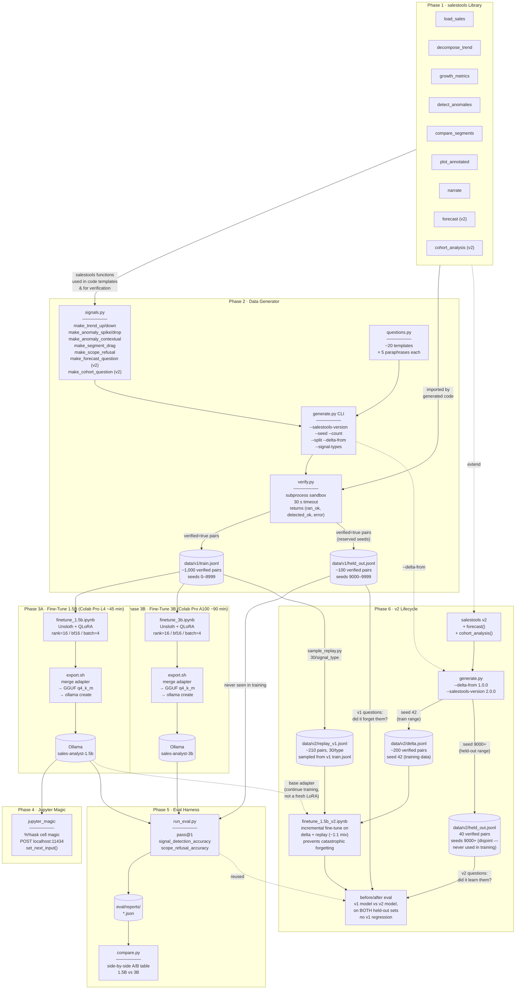
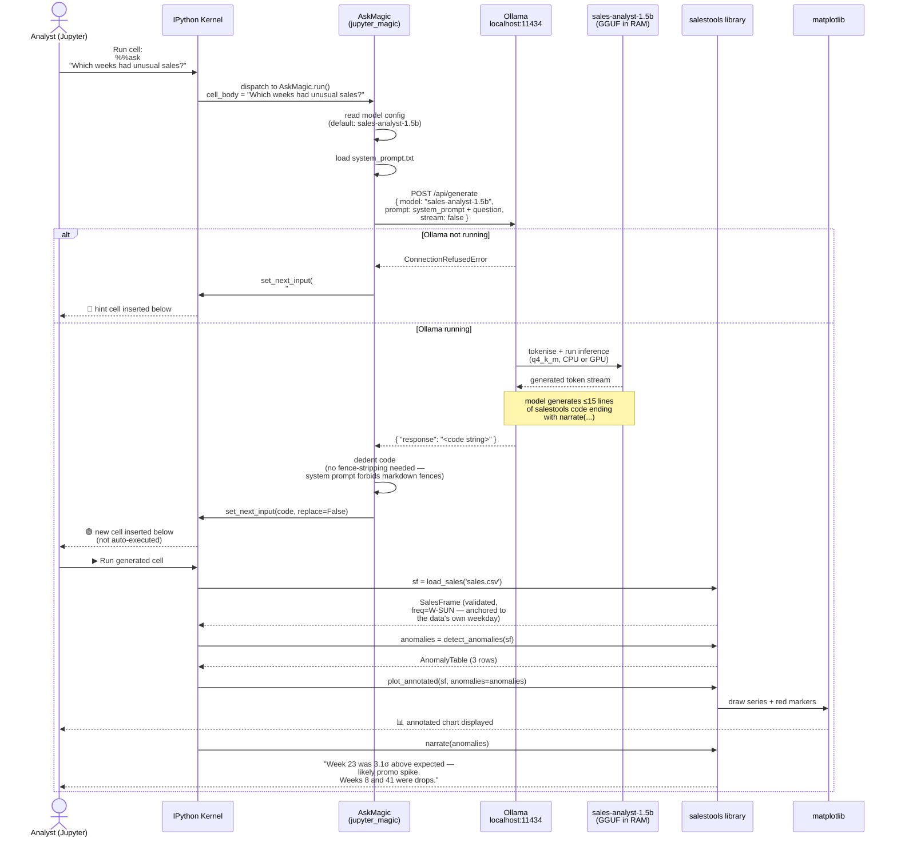
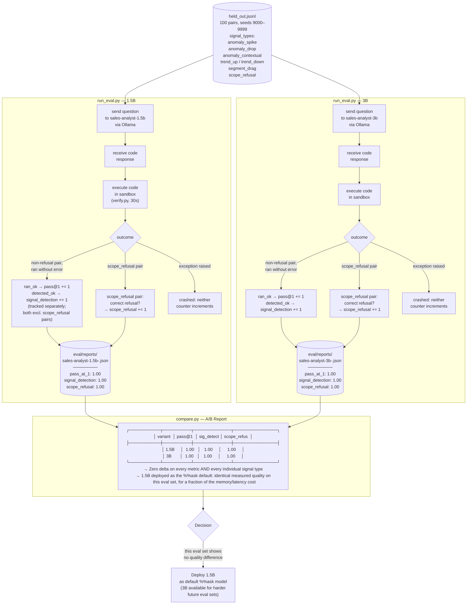

# salestools-analyst — Architecture Diagrams

Four views of the system, read in order:

1. **Pipeline Overview** — all six phases and how artifacts flow between them
2. **Data Generation** — how one verified training pair is produced
3. **`%%ask` Runtime** — what happens when a user types a question in Jupyter
4. **Evaluation & A/B Comparison** — how both model sizes are assessed

---

## 1. Pipeline Overview



---

## 2. Data Generation — One Verified Training Pair

```mermaid
sequenceDiagram
    actor Dev as Developer
    participant CLI as generate.py CLI
    participant SIG as signals.py
    participant QT  as questions.py
    participant VER as verify.py
    participant SBX as Subprocess Sandbox
    participant LIB as salestools
    participant OUT as train.jsonl / held_out.jsonl

    Dev->>CLI: python generate.py<br/>--salestools-version 1.0.0<br/>--seed 42 --count 1000<br/>--split train

    loop For each (signal_type, paraphrase_id, seed) in cross-product
        CLI->>SIG: make_{signal_type}(seed)
        SIG-->>CLI: (DataFrame with planted signal,<br/>detection_fn)

        CLI->>QT: get_questions(signal_type)[paraphrase_id]
        QT-->>CLI: question string<br/>(e.g. "Which weeks had unusual sales?")

        Note over CLI: look up code template<br/>for this signal_type<br/>(hand-written salestools code)

        CLI->>VER: verify_pair(code, DataFrame, detection_fn)

        VER->>SBX: spawn Process(target=run_code,<br/>timeout=30s)

        SBX->>LIB: import salestools
        SBX->>SBX: exec(code, clean_namespace)

        alt code raises exception
            SBX-->>VER: error: "NameError: ..."
            VER-->>CLI: (ran_ok=False, detected_ok=False, error=msg)
            Note over CLI: discard pair — never stored
        else code runs cleanly
            SBX->>SBX: detection_fn(namespace_output)
            alt planted signal NOT detected
                SBX-->>VER: (ran ok, but signal not found)
                VER-->>CLI: (ran_ok=True, detected_ok=False, error=msg)
                Note over CLI: discard pair — never stored<br/>(generator requires BOTH ok;<br/>eval harness tracks them separately)
            else planted signal detected
                SBX-->>VER: (ran ok, signal found)
                VER-->>CLI: (ran_ok=True, detected_ok=True, "")
                CLI->>OUT: write TrainingPair JSON line<br/>{ id, question, code,<br/>  signal_type, verified: true,<br/>  salestools_version, dataset_seed,<br/>  paraphrase_id }
            end
        end
    end

    CLI-->>Dev: ✅ 1,000 verified pairs written<br/>0 unverified pairs stored
```

---

## 3. `%%ask` Runtime — User Asks a Question in Jupyter



---

## 4. Evaluation & A/B Comparison


