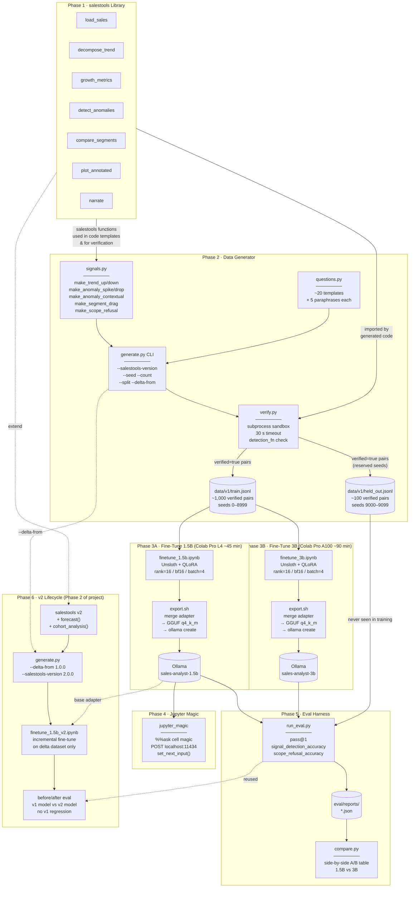
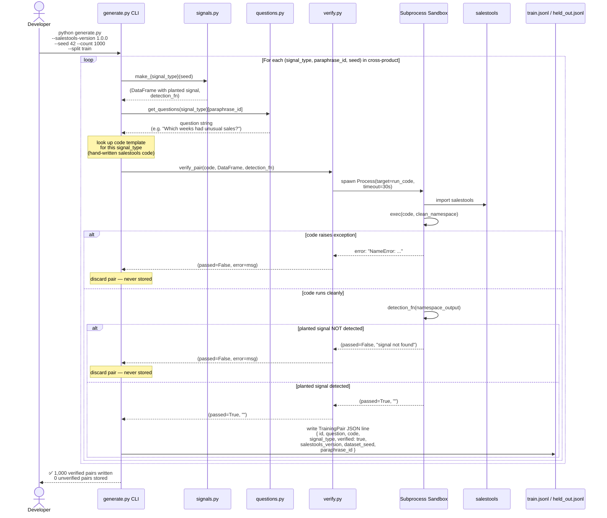
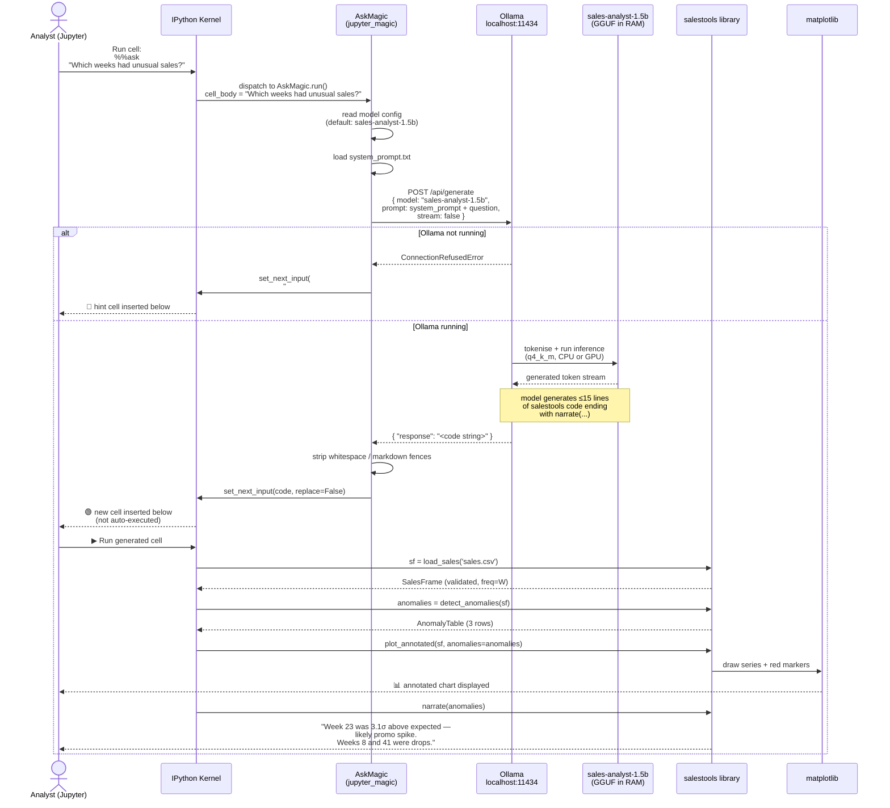
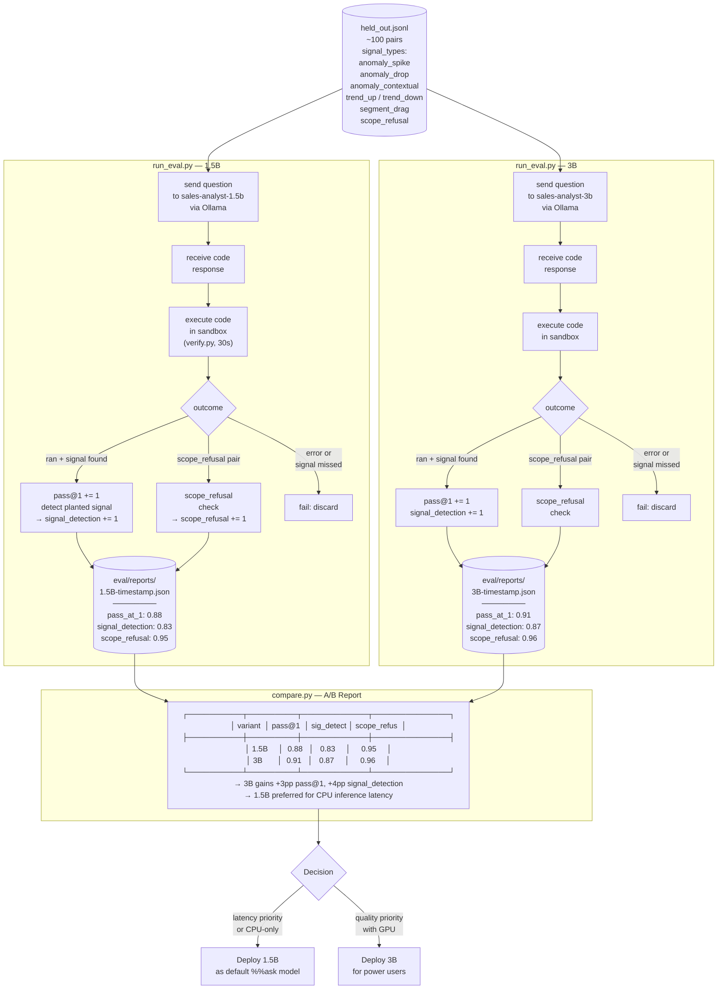

# salestools-analyst — Architecture Diagrams

Four views of the system, read in order:

1. **Pipeline Overview** — all six phases and how artifacts flow between them
2. **Data Generation** — how one verified training pair is produced
3. **`%%ask` Runtime** — what happens when a user types a question in Jupyter
4. **Evaluation & A/B Comparison** — how both model sizes are assessed

---

## 1. Pipeline Overview

---

## 2. Data Generation — One Verified Training Pair

---

## 3. `%%ask` Runtime — User Asks a Question in Jupyter

---

## 4. Evaluation & A/B Comparison

